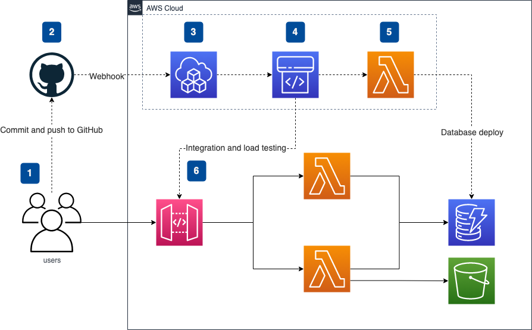

# Serverless AWS CDK Best Practices & Patterns with CDK Pipelines Part 2

An example of creating immutable builds using the AWS CDK and progressing them through environments to production using CDK Pipelines.

Part 2 covers:

✔️ We discuss adding code quality tools locally to the IDE and to the pipeline such as ESLint and Prettier (inc pre-commit hooks with Husky) in line with best practices.

✔️ We cover SAST tooling, in particular, cdk-nag in our pipeline to keep us secure from common issues.

✔️ We cover how to put various types of tests in your pipeline at the correct stages (unit, integration and load) to ensure our workloads are working as expected. We will look at Jest, Postman/Newman and Artillery specifically.

✔️ We will cover how to update databases, seed test data or seed configuration values in the pipeline using custom resources.


This article (Part 2) can be found here:
https://blog.serverlessadvocate.com/serverless-aws-cdk-pipeline-best-practices-patterns-part-2-5446a417d232


Part 1 of the article for this repo can be found here: https://leejamesgilmore.medium.com/serverless-aws-cdk-pipeline-best-practices-patterns-part-1-ab80962f109d

Part 1 code repo can be found here:
https://github.com/leegilmorecode/Serverless-AWS-CDK-Best-Practices-Patterns

---

## Getting started

We are going to build the following basic application to showcase the use of CDK Pipelines:



The diagram shows that:

1. Developers commit changes to the code and push to GitHub.
2. A webhook in GitHub invokes our CDK Pipeline.
3. CDK Pipelines are self mutating, meaning any changes to the pipeline itself or updated now.
4. Code Pipeline is invoked to run the actual pipeline now it has been updated.
5. As part of the pipeline a custom resource invokes a lambda which seeds our configuration data to DynamoDB.
6. Our pipeline performs integration tests using Newman and Postman; as well as load testing with Artillery.

**Note**: This is not production ready and is solely created for discussion points throughout the article.

---

## Deploying

We will deploy through the pipeline for feature-dev, staging and production, and also allow developers to use ephemeral environments based on their current pr number for quick dev environments (_as discussed in the article_).

---

### Deploying the pipeline

Firstly, we need to add the GitHub secret to AWS Secrets Manager in a secret called `github-token` as described here: https://docs.aws.amazon.com/cdk/api/v2/docs/aws-cdk-lib.pipelines.GitHubSourceOptions.html

To deploy the pipeline please run: `npm run deploy:pipeline` after adding your own account IDs in the `pipeline-types.ts` file.

Note: _to destroy please use the `npm run remove:pipeline' script_

---

### Deploying an ephemeral environment

To deploy a developer ephemeral environment:

1. Update the `.env` file and change the `PR_NUMBER` variable value.
2. Run the following command passing in your `PR_NUMBER` (example for 'PR-123' below):

```
cdk deploy ServerlessPro/Develop-PR-123/StatefulStack ServerlessPro/Develop-PR-123/StatelessStack --profile=featuredev
```

Note: _There is an example of this and the tear down in the package.json file for reference. This could easily be scripted_.

---
